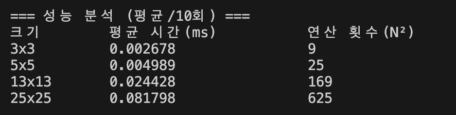

## 1. 실행 방법
`python main.py`

실행 후 모드를 선택한다.

1 -  사용자 입력 (3×3) 

2 - data.json 분석  

## 2. 구현 요약
### 2.1 MAC 연산

MAC(Multiply-Accumulate) 연산은
패턴과 필터의 같은 위치 값을 곱한 뒤,
그 결과를 모두 더하여 점수를 계산하는 방식이다.

구현은 2중 반복문을 사용하여
각 위치의 값을 직접 곱하고 누적하는 방식으로 작성하였다.

### 2.2 라벨 정규화

JSON 데이터에서는 다양한 형태의 라벨이 존재한다.

"+" → Cross
"cross" → Cross
"x" → X

이를 프로그램 내부에서는
Cross, X 두 가지 표준 라벨로 통일하여 비교하였다.

### 2.3 동점 처리 (epsilon)

부동소수점 연산의 오차를 고려하여
두 점수 차이가 1e-9 미만일 경우
동점(UNDECIDED)으로 처리하였다.

abs(score_a - score_b) < 1e-9  

### 2.4 크기 검증

패턴과 필터의 크기가 일치하지 않을 경우
프로그램이 종료되지 않고
해당 케이스만 FAIL 처리하도록 구현하였다.

## 3. 결과 리포트
### 3.1 전체 결과
data.json 분석 모드를 실행한 결과, 총 9개의 테스트 케이스를 검사하였다.
그중 6개는 PASS, 3개는 FAIL로 판정되었다.
프로그램은 정상 케이스뿐 아니라 의도적으로 삽입한 실패 케이스도 비정상 종료 없이 처리하도록 구현하였다.

#### 1. 전체 테스트 결과
총 테스트: 9개  
통과: 6개  
실패: 3개  

실패 케이스는 다음과 같다.

size_5_2: expected=X, result=Cross  
size_5_3: expected=Cross, result=UNDECIDED  
size_5_4: 크기 불일치: 행 개수 4 != 5  
#### 2. 실패 원인 분석

이번 테스트 데이터에는 프로그램의 안정성을 검증하기 위해 의도적으로 실패 케이스를 포함하였다.  
실패 원인은 크게 라벨 불일치, 수치 비교 정책, 스키마/크기 문제의 세 가지로 구분할 수 있었다.

첫 번째 실패 케이스인 size_5_2는 입력 패턴 자체는 Cross 형태이므로 Cross 필터와의 MAC 점수가 더 높게 계산되었다.  
실제 결과도 Cross 점수: 9.0, X 점수: 1.0으로 Cross가 우세했지만, expected 값이 X로 들어 있어 FAIL이 발생했다.  
이 경우는 프로그램 로직 문제라기보다 데이터 라벨링 문제에 해당한다.

두 번째 실패 케이스인 size_5_3는 모든 값이 0인 패턴이다.  
이 경우 Cross 필터와 X 필터 모두 곱셈 결과가 전부 0이 되어 최종 점수가 동일하게 계산되었다.  
프로그램은 부동소수점 비교 정책에 따라 abs(score_a - score_b) < 1e-9이면 동점으로 간주하고 UNDECIDED를 반환하도록 구현하였다.  
따라서 size_5_3은 로직상 올바르게 UNDECIDED가 나왔지만, expected가 Cross였기 때문에 FAIL이 되었다.  
이 케이스는 수치 비교 정책과 판정 기준을 확인하기 위한 테스트로 볼 수 있다.

세 번째 실패 케이스인 size_5_4는 key는 size_5_* 형식이지만 실제 입력 행렬은 4×4였다.  
프로그램은 pattern key에서 크기 5를 추출한 뒤, 실제 input 행렬이 5×5인지 검증하도록 구현하였다.  
그 결과 행 개수 4 != 5를 감지하고 해당 케이스를 FAIL 처리하였다.  
이 경우는 스키마/데이터 구조 문제이며, 프로그램이 중간에 종료되지 않고 케이스 단위로 실패를 기록했다는 점이 중요하다.

이처럼 실패 3건은 각각 다른 종류의 문제를 보여준다.
하나는 라벨 오류, 하나는 동점 처리 규칙, 하나는 크기 불일치 문제였다.  
즉 프로그램은 단순히 정답만 맞히는 것이 아니라, 실패 원인을 분리해서 진단할 수 있도록 설계되었다고 정리할 수 있다.

#### 3. 라벨 정규화와 epsilon 정책의 의미

이번 과제에서는 JSON의 expected 값으로 "+", "x" 같은 표현이 들어오고, 필터 키는 "cross", "x" 형태로 저장되어 있었다.  
이를 그대로 비교하면 문자열 표현 차이 때문에 잘못된 PASS/FAIL이 발생할 수 있다.  
그래서 프로그램 내부에서는 "+", "cross"를 모두 Cross로, "x"를 X로 정규화하였다.

또한 부동소수점 계산에서는 사람이 보기엔 같은 값처럼 보여도 아주 작은 차이가 생길 수 있다.  
이를 고려하여 점수 비교 시 epsilon = 1e-9 기준을 적용했다.  
이 정책 덕분에 사실상 동일한 점수는 UNDECIDED로 안정적으로 처리할 수 있었고, all-zero 패턴 같은 케이스도 일관된 규칙으로 분석할 수 있었다.

### 3.3 실패가 0개가 아닌 이유

본 테스트 데이터에는
의도적으로 잘못된 케이스를 포함하여

- 스키마 오류  
- 라벨 오류  
- 수치 비교 문제  
를 검증하도록 설계하였다.

## 4. 성능 분석
### 4.1 측정 방법
MAC 연산을 10회 반복 수행  
평균 실행 시간(ms) 측정  
I/O를 제외한 연산 구간만 측정  
### 4.2 성능 결과
      
### 4.3 시간 복잡도 분석

MAC 연산은 2중 반복문을 사용하여
`N×N` 크기의 모든 요소를 순회한다.

```
for i in range(N):  
    for j in range(N):
```
따라서 전체 연산 횟수는

N × N = N²

즉 시간 복잡도는 O(N²) 이다.

### 4.4 결과 해석

실제 측정 결과에서도

3×3 → 9회  
25×25 → 625회

로 연산 횟수가 증가하면서
실행 시간이 함께 증가하는 것을 확인할 수 있었다.

이를 통해 MAC 연산이 입력 크기에 따라
제곱 비율로 증가함을 확인하였다.
